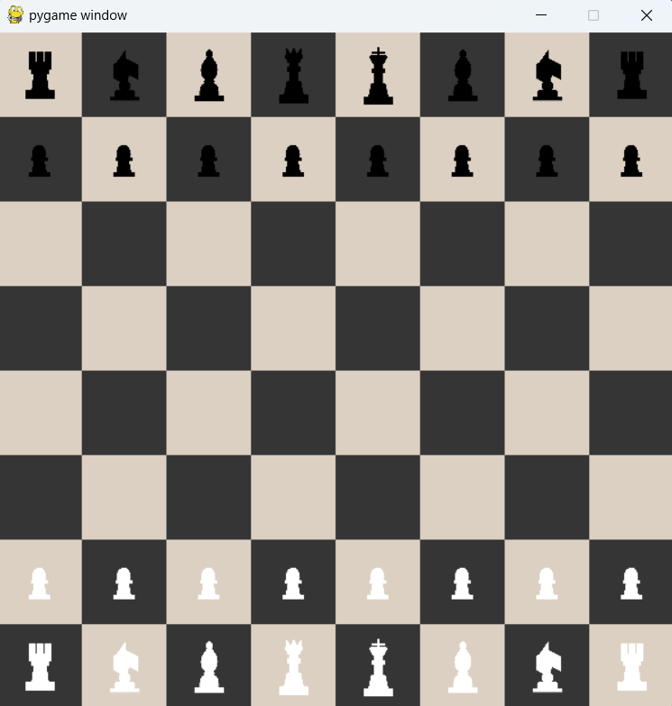

# Chess Game with Python and Pygame



This is a simple Chess Game implemented using Python and the Pygame library. It allows two players to play a game of chess on a graphical user interface.

## Table of Contents

- [Features](#features)
- [Installation](#installation)
- [Usage](#usage)
- [Controls](#controls)
- [Rules](#rules)
- [Contributing](#contributing)
- [License](#license)

## Features

- Classic two-player chess game.
- User-friendly graphical interface built with Pygame.
- Highlights possible moves when a piece is selected.
- Displays current player's turn.
- Pawn promotion.
- Castling and en passant moves are supported.

## Installation

1. Make sure you have Python 3.x installed on your system.
2. Clone this repository or download the ZIP file and extract it.

```bash
git clone https://github.com/your-username/chess-game-python.git
```

3. Navigate to the project directory.

```bash
cd python-chess
```

4. Install the required dependencies. You can use `pip` to install Pygame.

```bash
pip install pygame
```

## Usage

1. Run the game script.

```bash
python main.py
```

2. The chess game window will appear. You can now start playing.

## Controls

- Click on a piece to select it.
- Click on a highlighted square to move the selected piece there.
- Press `ESC` to exit the game at any time.

## Rules

This game follows the standard rules of chess. If you are unfamiliar with the rules, you can find them [here](https://www.chess.com/learn-how-to-play-chess).

## Contributing

Contributions are welcome! If you find any issues or want to enhance the game, feel free to submit a pull request. Make sure to follow the existing code style and guidelines.

1. Fork the repository.
2. Create a new branch: `git checkout -b feature-new-feature`.
3. Make your changes and commit them: `git commit -m "Add new feature"`.
4. Push to the branch: `git push origin feature-new-feature`.
5. Open a pull request explaining your changes.

## License

This project is done as the final project of CS50.

---

Enjoy the game of chess with your friends and improve your strategic thinking! If you have any questions or suggestions, feel free to contact us at mjgandhi2305@gmail.com.
